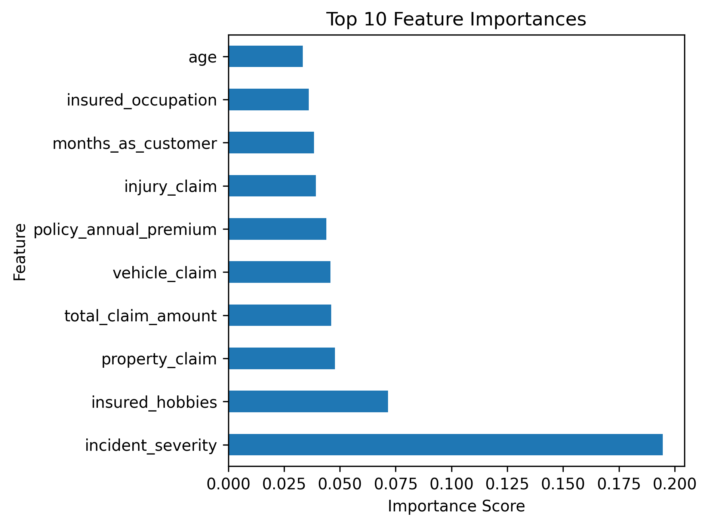
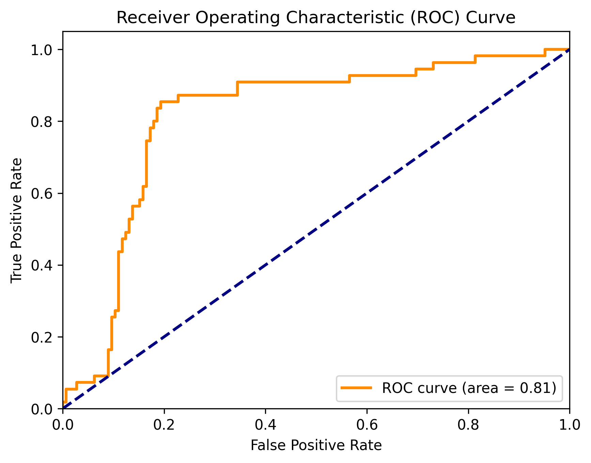

# 🕵️‍♂️ Insurance Claims Fraud Detection using Machine Learning

Welcome to my actuarial machine learning project! This repository showcases a full pipeline for detecting fraudulent insurance claims using real-world data. The solution includes data cleaning, feature engineering, model building, evaluation, visualization, and deployment — all tailored to demonstrate applied data science in an actuarial context.

## 🚀 Project Objective

Fraudulent insurance claims can significantly impact loss reserves, pricing, and solvency. This project builds predictive models to classify whether an insurance claim is likely to be fraudulent (`Y` or `N`) based on structured claim features.

As an aspiring actuary with a passion for analytics, I developed this end-to-end pipeline to apply advanced predictive techniques like **XGBoost** in a real-world insurance setting.

---

## 📂 Project Structure

- `main.py`: Core Python script for the full pipeline.
- `insurance_claims.csv`: Dataset of anonymized claims records.
- `xgboost_model.pkl`: Serialized model for deployment or scoring.

---

## 🔍 What This Project Does

✅ Loads and cleans insurance claims data  
✅ Encodes categorical and binary variables  
✅ Trains and compares **Logistic Regression**, **Random Forest**, and **XGBoost**  
✅ Evaluates models with classification metrics  
✅ Visualizes **feature importances** and **ROC curve**  
 

✅ Saves the best model for future deployment using `.pkl`

---

## 📊 Technologies & Tools

| Tool | Purpose |
|------|---------|
| **Python** | Core language |
| **pandas** | Data manipulation |
| **scikit-learn** | Machine learning models and evaluation |
| **xgboost** | Advanced boosting model |
| **matplotlib** | Visualization |
| **pickle** | Model serialization |

---

## 🧠 Models Trained

| Model               | Purpose                         |
|--------------------|----------------------------------|
| Logistic Regression | Baseline linear classifier      |
| Random Forest       | Ensemble with feature insight   |
| XGBoost             | 🔥 High-performance booster      |

### 📈 Model Evaluation Metrics:
- **Confusion Matrix**
- **Classification Report** (Precision, Recall, F1)
- **Accuracy**
- **ROC Curve + AUC Score**

---

## 📌 Key Features

### 📂 Data Preprocessing
- Dropped irrelevant columns (e.g. ZIP code, dates)
- Handled missing values
- Label encoded categorical columns

### 📉 Feature Scaling
- Standardized numeric features to improve convergence for linear models

### 🤖 Modeling
- Compared model performance across Logistic Regression, Random Forest, and XGBoost
- Tuned XGBoost for accuracy and efficiency

### 📈 ROC Curve Visualization
The project includes a clean visualization of the ROC curve and computes AUC to better understand model performance under class imbalance.

### 💾 Model Saving
Saved the best-performing XGBoost model as a `.pkl` file for future use or API deployment.

```python
with open('xgboost_model.pkl', 'wb') as model_file:
    pickle.dump(model, model_file)
